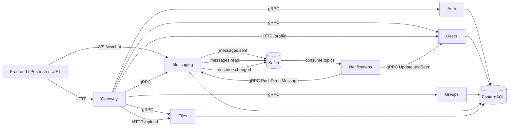

# GroupsApp — Microservices Edition

Sistema de chat/grupos implementado con arquitectura de microservicios, mensajería en tiempo real y eventos con Kafka.

Este repositorio (`groupsapp-ms`) está orientado a **demo y validación end-to-end** de:
- autenticación,
- gestión de usuarios y grupos,
- mensajería WebSocket,
- notificaciones asíncronas.

## 1) Arquitectura del sistema

### Microservicios

| Servicio | Rol | gRPC | HTTP/WS |
|---|---|---:|---:|
| `gateway` | Punto de entrada único (API pública) | — | `:8000` |
| `auth` | Registro/login/refresh/validación token | `:50051` | — |
| `users` | Perfil, búsqueda, `last_seen` | `:50052` | `:8003` |
| `groups` | CRUD grupos, miembros, canales | `:50053` | — |
| `messaging` | Persistencia + WS chat | `:50054` | WS `:8001` |
| `files` | Upload y metadatos | `:50055` | `:8002` |
| `notifications` | Consumer Kafka y push de eventos | — | — |

### Diagrama (Mermaid)



## 2) Stack tecnológico

- Python 3.11
- FastAPI (Gateway + servicios REST)
- Django + Channels (Messaging/Auth)
- gRPC + Protocol Buffers
- Apache Kafka + Zookeeper
- PostgreSQL
- Docker Compose
- WebSockets

## 3) Variables de entorno

Archivo base: `.env.example`

Variables principales:
- `POSTGRES_DB`, `POSTGRES_USER`, `POSTGRES_PASSWORD`, `POSTGRES_HOST`, `POSTGRES_PORT`
- `KAFKA_BROKER`
- `JWT_SECRET_KEY`, `JWT_ACCESS_MINUTES`, `JWT_REFRESH_DAYS`
- `LOG_LEVEL`

### Inicio rápido

> En Linux/macOS:

```bash
cp .env.example .env
docker compose up -d --build
python scripts/smoke_test.py
python scripts/e2e_demo.py
```

> En Windows PowerShell:

```powershell
Copy-Item .env.example .env
docker compose up -d --build
python scripts/smoke_test.py
python scripts/e2e_demo.py
```

## 4) Flujo general del sistema

1. Cliente llama `Gateway` para auth/users/groups/files.
2. `Gateway` valida JWT vía `Auth.ValidateToken`.
3. Mensajes en tiempo real via `Messaging` (WS `:8001`).
4. `Messaging` publica eventos Kafka:
   - `messages.sent`
   - `messages.read`
   - `presence.changed`
5. `Notifications` consume eventos:
   - hace push a usuarios por gRPC en `Messaging`,
   - actualiza `last_seen` en `Users`.

## 5) Pruebas y estabilidad E2E

### Smoke test (infra + servicios)

```bash
python scripts/smoke_test.py
```

Valida:
- health gRPC/HTTP,
- disponibilidad del gateway,
- existencia de topics Kafka esperados.

### E2E completo

```bash
python scripts/e2e_demo.py
```

Valida flujo integrado:
- register/login,
- grupos y membership,
- WS (mensaje grupal y privado),
- notificaciones y read receipts,
- historial, perfil, archivos, búsqueda.

### Estabilidad (5 corridas consecutivas)

```bash
python scripts/e2e_stability_runner.py --runs 5
```

## 6) Endpoints principales (Gateway)

Base URL: `http://localhost:8000`

### Auth
- `POST /api/auth/register`
- `POST /api/auth/login`
- `POST /api/auth/refresh`
- `POST /api/auth/logout`

### Users
- `GET /api/users/me`
- `GET /api/users/me/profile`
- `PATCH /api/users/me/profile`
- `GET /api/users/{user_id}/profile`
- `GET /api/users/search?q=...`

### Groups
- `GET /api/groups/me`
- `POST /api/groups`
- `GET /api/groups/{id}`
- `PATCH /api/groups/{id}`
- `DELETE /api/groups/{id}`
- `POST /api/groups/{id}/join`
- `POST /api/groups/{id}/leave`
- `GET /api/groups/{id}/members`
- `POST /api/groups/{id}/members?user_id=...`
- `DELETE /api/groups/{id}/members/{uid}`
- `PATCH /api/groups/{id}/members/{uid}/role`
- `GET /api/groups/{id}/channels`
- `POST /api/groups/{id}/channels`
- `GET /api/groups/{id}/membership`

### Messages
- `GET /api/messages/history?group_id=...&limit=50`
- `GET /api/messages/conversations`

### Files
- `POST /api/files/upload`
- `GET /api/files/{id}`

### WebSocket
- `ws://localhost:8001/ws/chat/?token=JWT`

Mensajes soportados:
- send private:
  `{"type":"message","content":"...","receiver_id":"...","message_type":"text"}`
- send group:
  `{"type":"message","content":"...","group_id":"...","message_type":"text"}`
- read receipt:
  `{"type":"read","message_id":"..."}`

## 7) Demo rehearsal

Rehearsal recomendado (sin scripts adicionales):

1. Levantar servicios:
   - `docker compose up -d --build`
2. Validar salud:
   - `python scripts/smoke_test.py`
3. Ejecutar E2E completo:
   - `python scripts/e2e_demo.py`
4. Validar estabilidad (5 corridas seguidas):
   - `python scripts/e2e_stability_runner.py --runs 5`

## 8) Errores comunes y soluciones

- `failed to connect to the docker API ... dockerDesktopLinuxEngine`
  - Docker Desktop no está iniciado. Inícialo y reintenta `docker compose up -d --build`.

- `SKIP WebSocket tests (websockets package not installed)`
  - Instala dependencia local: `pip install websockets`.

- `Messaging service unavailable` o `Auth/Users/Groups unavailable`
  - Revisa estado: `docker compose ps`
  - Logs: `docker compose logs <service>`
  - Espera readiness y vuelve a correr `python scripts/smoke_test.py`.

- Fallo al subir archivos (`Upload failed`)
  - Verifica `files` y `gateway` en `docker compose ps` y sus logs.

- Topics faltantes en Kafka en `smoke_test.py`
  - Reinicia stack: `docker compose down -v` y luego `docker compose up -d --build`.
